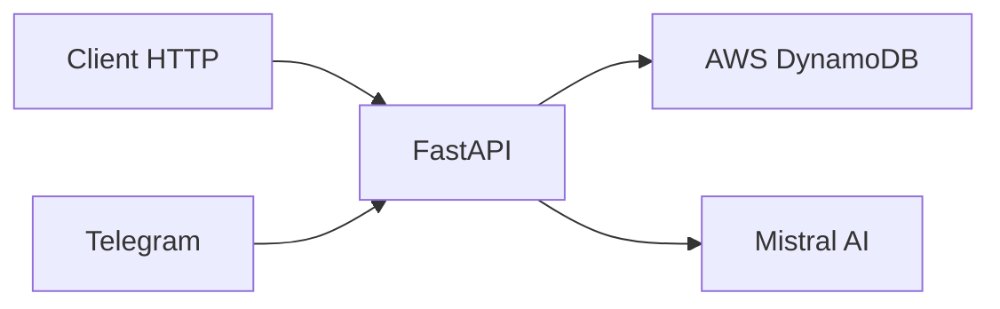

# Chatbot avec FastAPI, Telegram et DynamoDB

Un chatbot intelligent utilisant Mistral AI, accessible via une API REST et Telegram, avec stockage persistant dans AWS DynamoDB.

## Fonctionnalités

- API REST avec FastAPI
- Intégration Telegram
- Réponses intelligentes via Mistral AI
- Stockage persistant avec DynamoDB
- Historique des conversations
- Sécurité et gestion des erreurs

## Démarrage Rapide

Consultez [QUICKSTART.md](docs/QUICKSTART.md) pour une installation rapide.

## Structure du Projet

```
chatbot/
├── src/                      # Code source principal
│   ├── __init__.py
│   ├── main.py              # Point d'entrée FastAPI
│   ├── config.py            # Configuration et variables d'environnement
│   ├── telegram_bot.py      # Gestionnaire du bot Telegram
│   ├── utils.py             # Utilitaires
│   ├── models/              # Modèles de données
│   │   ├── __init__.py
│   │   ├── message.py       # Modèle de message
│   │   └── conversation.py  # Modèle de conversation
│   ├── services/            # Logique métier
│   │   ├── __init__.py
│   │   ├── chat.py         # Service de chat
│   │   └── storage.py      # Service de stockage DynamoDB
│
├── tools/                   # Outils et scripts
│   ├── init.py             # Script d'initialisation
│   ├── setup_dynamodb.py   # Configuration DynamoDB
│   └── set_webhook.py      # Configuration webhook Telegram
│
├── tests/                  # Tests
│   ├── __init__.py
│   ├── conftest.py        # Configuration pytest
│   ├── test_api.py        # Tests API
│   └── test_utils.py      # Tests des fonctions utilitaires
│
├── docs/                   # Documentation
│   ├── QUICKSTART.md      # Guide de démarrage rapide
│   ├── API.md             # Documentation API
│   ├── ARCHITECTURE.md    # Architecture technique
│   ├── DEPLOYMENT.md      # Guide de déploiement
│
├── CONTRIBUTING.md    # Guide de contribution
├── .env.example           # Template des variables d'environnement
├── requirements.txt       # Dépendances Python
├── pytest.ini            # Configuration des tests
└── README.md             # Ce fichier
```

## Technologies Utilisées

- **Backend**: FastAPI, Python 3.8+
- **Base de données**: AWS DynamoDB
- **IA**: Mistral AI
- **Bot**: API Telegram
- **Tests**: pytest
- **Qualité**: black, flake8, mypy

## Architecture



Pour plus de détails, consultez [ARCHITECTURE.md](docs/ARCHITECTURE.md).

## Configuration

1. Copiez `.env.example` vers `.env`
2. Configurez vos variables d'environnement :
   ```env
   AWS_ACCESS_KEY_ID=votre_access_key
   AWS_SECRET_ACCESS_KEY=votre_secret_key
   AWS_REGION=votre_region
   TELEGRAM_BOT_TOKEN=votre_token_bot
   MISTRAL_API_KEY=votre_cle_api
   DYNAMODB_TABLE_NAME=nom_de_votre_table
   ```

## Documentation

- [Guide de Démarrage](docs/QUICKSTART.md)
- [Documentation API](docs/API.md)
- [Architecture](docs/ARCHITECTURE.md)
- [Déploiement](docs/DEPLOYMENT.md)
- [Contribution](CONTRIBUTING.md)

## Tests

```bash
# Lancer tous les tests
pytest

# Avec couverture
pytest --cov=src

# Tests spécifiques
pytest tests/test_api.py
```

## Contribution

Les contributions sont les bienvenues ! Consultez [CONTRIBUTING.md](CONTRIBUTING.md).

## Bonnes Pratiques

- Suivez les conventions [PEP8](https://www.python.org/dev/peps/pep-0008/)
- Écrivez des tests pour les nouvelles fonctionnalités
- Documentez votre code
- Utilisez les types statiques
- Évitez les scans DynamoDB

## Licence

Ce projet est sous licence MIT. Voir le fichier [LICENSE](LICENSE) pour plus de détails.

## Remerciements

- [FastAPI](https://fastapi.tiangolo.com/)
- [python-telegram-bot](https://python-telegram-bot.org/)
- [Mistral AI](https://mistral.ai/)
- [AWS DynamoDB](https://aws.amazon.com/dynamodb/) 