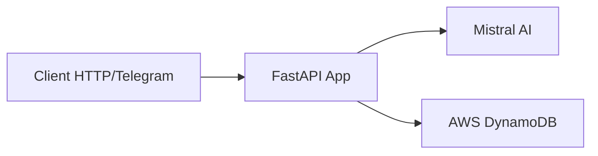

# Architecture du Projet

## Vue d'ensemble



## Composants Principaux

### 1. API FastAPI (`src/main.py`)
- Point d'entrée de l'application
- Gestion des routes HTTP
- Configuration de l'application
- Middleware CORS
- Gestion des webhooks Telegram

### 2. Bot Telegram (`src/telegram_bot.py`)
- Gestion des interactions Telegram
- Traitement des messages
- Gestion des commandes
- Maintien du contexte de conversation

### 3. Configuration (`src/config.py`)
- Variables d'environnement
- Configuration de l'application
- Gestion des secrets

### 4. Utilitaires (`src/utils.py`)
- Fonctions d'aide
- Interactions avec DynamoDB
- Logging
- Gestion des erreurs

## Structure de Données

### DynamoDB

#### Table Principale
- **Nom**: `<nom-de-votre-table>`
- **Clé Primaire**: `id` (String)
- **Index Secondaire Global**:
  - Nom: `conversation_id-timestamp-index`
  - Partition Key: `conversation_id`
  - Sort Key: `timestamp`

#### Structure d'un Item
```json
{
    "id": {
        "S": "uuid-string"
    },
    "conversation_id": {
        "S": "conversation-uuid-or-telegram-chat-id"
    },
    "timestamp": {
        "S": "iso-datetime-string"
    },
    "question": {
        "S": "user-question"
    },
    "answer": {
        "S": "ai-response"
    },
    "source": {
        "S": "api|telegram"
    }
}
```

## Flux de Données

1. **Via API HTTP**:
   ```
   Client -> /chat endpoint -> Mistral AI -> DynamoDB -> Response
   ```

2. **Via Telegram**:
   ```
   Telegram -> Webhook -> Bot Handler -> Mistral AI -> DynamoDB -> Telegram Response
   ```

## Sécurité

- Authentification AWS via credentials
- Webhook HTTPS pour Telegram
- Variables d'environnement pour les secrets
- CORS configuré pour l'API

## Monitoring et Logging

- Logs d'application via `Utils.log_*`
- CloudWatch pour les logs AWS
- Traces DynamoDB
- Webhook errors

## Scalabilité

- DynamoDB auto-scaling
- FastAPI async support
- Telegram webhook mode 